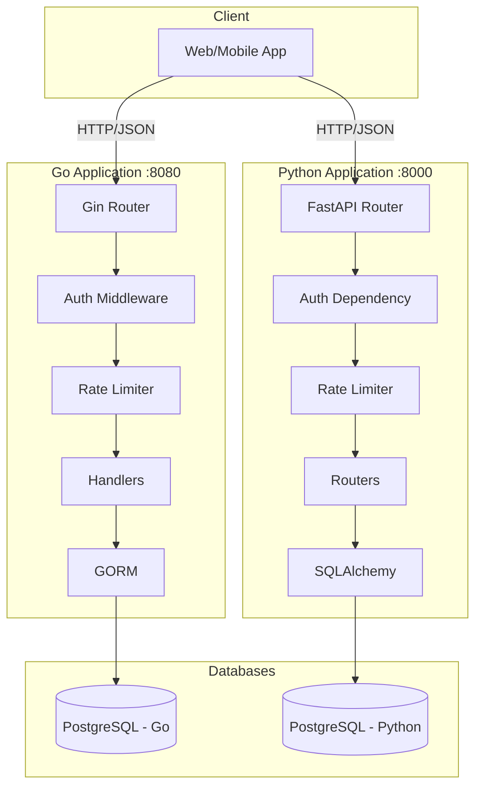
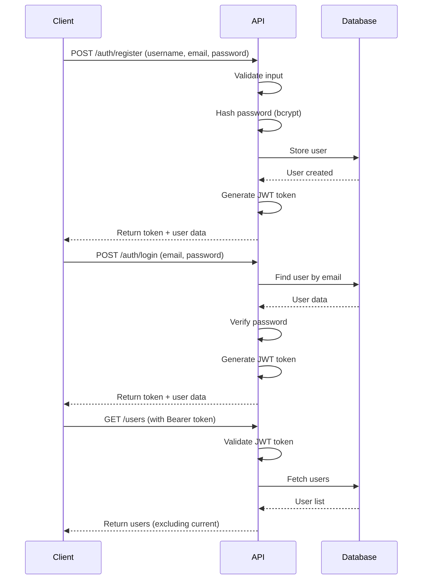

# Dockerized CRUD Applications

Two production-ready, fully containerized CRUD applications demonstrating enterprise-grade security, scalability, and best practices. Built as part of a technical assessment showcasing expertise in modern backend development.

## 📦 Projects

This repository contains two independent CRUD applications:

### 1. [Go CRUD Application](./go-crud-app)
- **Framework**: Gin Web Framework
- **ORM**: GORM
- **Database**: PostgreSQL
- **Features**: JWT authentication, bcrypt password hashing, rate limiting, comprehensive tests
- **Port**: 8080

### 2. [Python FastAPI CRUD Application](./python-crud-app)
- **Framework**: FastAPI
- **ORM**: SQLAlchemy
- **Database**: PostgreSQL
- **Features**: JWT authentication, bcrypt password hashing, rate limiting, auto-generated API docs
- **Port**: 8000

## 🎯 Common Features

Both applications implement identical functionality with language-specific best practices:

### Core Functionality
- ✅ **User Registration** with email and password
- ✅ **User Login** with JWT token generation
- ✅ **CRUD Operations** (Create, Read, Update, Delete)
- ✅ **List Users** (excluding current user)
- ✅ **Profile Management** (users can only modify their own data)

### Security Measures
- 🔐 **JWT Authentication** with configurable expiration
- 🔒 **Password Hashing** using bcrypt (cost factor 12)
- 🛡️ **Password Validation** (min 8 chars, uppercase, lowercase, number)
- ⚡ **Rate Limiting** to prevent brute force attacks
- 🚫 **SQL Injection Prevention** via ORM parameterization
- 🌐 **CORS Configuration** for cross-origin requests
- 🔑 **Environment Variable Management** for secrets
- 👤 **Non-root Docker Containers** for enhanced security

### Development Features
- 🐳 **Docker & Docker Compose** for easy deployment
- 🧪 **Comprehensive Unit Tests** for core functionalities
- 📚 **Detailed Documentation** with API examples
- 🏗️ **Clean Architecture** with separation of concerns
- 📝 **Code Comments** for maintainability

## 🚀 Quick Start

### Prerequisites
- Docker (version 20.10+)
- Docker Compose (version 2.0+)

### Running Go Application
```bash
cd go-crud-app
cp .env.example .env
# Edit .env to set JWT_SECRET and other configs (REQUIRED)
docker-compose up --build
```
> [!IMPORTANT]
> A `.env` file is mandatory. Docker Compose will fail to start the services if required variables are missing.
Access at: http://localhost:8080

### Running Python Application
```bash
cd python-crud-app
cp .env.example .env
# Edit .env to set JWT_SECRET and other configs (REQUIRED)
docker-compose up --build
```
> [!IMPORTANT]
> A `.env` file is mandatory. Docker Compose will fail to start the services if required variables are missing.
Access at: http://localhost:8000
- **API Docs (Swagger)**: http://localhost:8000/docs
- **API Docs (ReDoc)**: http://localhost:8000/redoc

## 📊 Architecture Overview



## 🔒 Security Implementation

### Authentication Flow


### Rate Limiting Strategy

| Endpoint | Limit | Window | Reason |
|----------|-------|--------|--------|
| `/auth/register` | 3 requests | 1 minute | Prevent spam accounts |
| `/auth/login` | 5 requests | 1 minute | Prevent brute force |
| `/users/*` | 100 requests | 1 minute | Normal usage protection |

## 📚 API Endpoints

Both applications expose identical REST APIs:

### Public Endpoints
- `POST /api/auth/register` - Register new user
- `POST /api/auth/login` - Login and get JWT token

### Protected Endpoints (Require JWT)
- `GET /api/users/me` - Get current user profile
- `GET /api/users` - List all users (excluding current)
- `GET /api/users/:id` - Get user by ID
- `PUT /api/users/:id` - Update user (own profile only)
- `DELETE /api/users/:id` - Delete user (own profile only)

### Example Request
```bash
# Register
curl -X POST http://localhost:8080/api/auth/register \
  -H "Content-Type: application/json" \
  -d '{
    "username": "johndoe",
    "email": "john@example.com",
    "password": "SecurePass123"
  }'

# Login
curl -X POST http://localhost:8080/api/auth/login \
  -H "Content-Type: application/json" \
  -d '{
    "email": "john@example.com",
    "password": "SecurePass123"
  }'

# Get users (with token)
curl http://localhost:8080/api/users \
  -H "Authorization: Bearer YOUR_JWT_TOKEN"
```

## 🧪 Testing

### Go Application
```bash
cd go-crud-app
go test ./tests/... -v -cover
```

### Python Application
```bash
cd python-crud-app
pytest tests/ -v --cov=app
```

## 📁 Project Structure Comparison

### Go Application
```
go-crud-app/
├── cmd/server/          # Application entry point
├── internal/
│   ├── models/          # Data models (GORM)
│   ├── handlers/        # HTTP handlers
│   ├── middleware/      # Auth & rate limiting
│   ├── database/        # DB connection
│   └── utils/           # JWT & password utilities
├── tests/               # Unit tests
└── docker-compose.yml   # Docker setup
```

### Python Application
```
python-crud-app/
├── app/
│   ├── main.py          # Application entry point
│   ├── models/          # Data models (SQLAlchemy)
│   ├── schemas/         # Pydantic schemas
│   ├── routers/         # API routes
│   ├── dependencies/    # Auth & DB dependencies
│   ├── core/            # Config & security
│   └── middleware/      # Rate limiting
├── tests/               # Unit tests
└── docker-compose.yml   # Docker setup
```

## 🛠️ Technology Stack

| Component | Go Application | Python Application |
|-----------|----------------|-------------------|
| **Framework** | Gin | FastAPI |
| **ORM** | GORM | SQLAlchemy |
| **Database** | PostgreSQL 15 | PostgreSQL 15 |
| **Auth** | golang-jwt/jwt | python-jose |
| **Password** | bcrypt | passlib[bcrypt] |
| **Validation** | Custom | Pydantic |
| **Testing** | Go testing | pytest |
| **Container** | Alpine Linux | Python slim |

## 🔧 Configuration

Both applications use environment variables for configuration:

### Required Variables
All variables below are **required** when running with Docker Compose. Default values have been removed to ensure security and explicit configuration.

- `DB_HOST`, `DB_PORT`, `DB_USER`, `DB_PASSWORD`, `DB_NAME` - Database config
- `JWT_SECRET` - **CRITICAL**: Must be changed in production
- `PORT` - Application port
- `CORS_ORIGIN` - Allowed CORS origins

### Example .env
```env
DB_HOST=localhost
DB_PORT=5432
DB_USER=postgres
DB_PASSWORD=your-secure-password
DB_NAME=appdb
JWT_SECRET=your-very-long-random-secret-key
PORT=8080
CORS_ORIGIN=*
```

## 🚀 Production Deployment Checklist

- [ ] Change `JWT_SECRET` to a long, random string
- [ ] Use strong database passwords
- [ ] Configure CORS to allow only specific origins
- [ ] Enable SSL/TLS for database connections
- [ ] Set up proper logging and monitoring
- [ ] Use secrets management (not .env files)
- [ ] Enable database backups
- [ ] Set up health checks and alerts
- [ ] Review and adjust rate limits
- [ ] Enable HTTPS for API endpoints

## 📖 Documentation

Each application has its own detailed README:
- [Go Application README](./go-crud-app/README.md)
- [Python Application README](./python-crud-app/README.md)

## 🐛 Troubleshooting

### Port Conflicts
If ports 8080 or 8000 are already in use, modify the `PORT` variable in `.env` and update `docker-compose.yml` accordingly.

### Database Connection Issues
```bash
# Check if containers are running
docker-compose ps

# View logs
docker-compose logs

# Restart services
docker-compose down
docker-compose up --build
```

### JWT Token Issues
Tokens expire after 24 hours by default. Login again to get a new token.

## 📝 License

This project is licensed under the MIT License.

## 👨‍💻 Author

Built with ❤️ as a demonstration of modern backend development practices.

## 🤝 Contributing

Contributions are welcome! Please feel free to submit a Pull Request.

## 📧 Support

For questions or issues, please open an issue in the repository.
